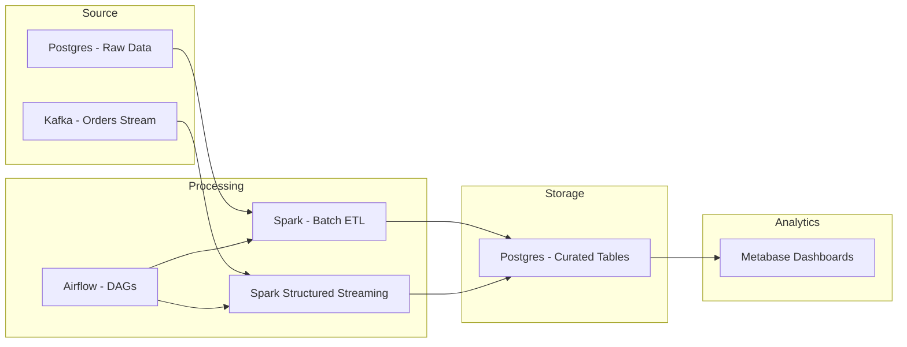

# E-Commerce Data Pipeline - Design Document

## 1. Architecture Overview

The pipeline ingests both **batch data** (historical e-commerce tables) and **streaming data** (real-time orders).  

- **Postgres** stores raw and curated data.  
- **Kafka** ingests real-time order events.  
- **Spark** processes both batch and streaming data.  
- **Airflow** orchestrates the batch jobs and manages dependencies.  
- **Metabase** provides analytics dashboards for business stakeholders.  

The system is fully containerized using **Docker Compose** for local reproducibility.  

---

## 2. High-Level Architecture Diagram

## 3. Data Flow Description

### Batch Ingestion

Historical e-commerce data is seeded into Postgres.

Airflow triggers a Spark batch job daily.

Spark reads from Postgres → cleans/transforms → writes back curated tables.

### Streaming Ingestion

A Kafka producer simulates new orders (e.g., Faker Python script).

Spark Structured Streaming consumes the events from Kafka.

Streaming jobs enrich/clean the data and persist into Postgres in near real-time.

### Analytics & Visualization

Metabase connects directly to curated Postgres tables.

Dashboards provide:

Daily revenue trends

Top-selling products

Orders per customer segment

Real-time order inflow

## 4. Component Design

Postgres

Stores raw tables (customers, products, orders) and curated tables (fact_orders, dim_customers, dim_products).

Acts as both OLTP (seed data) and OLAP (reporting) for MVP.

Kafka

Ingests real-time order events.

Topics:

orders (raw incoming events)

orders_cleaned (optional, after Spark enrichment).

Spark

Batch Jobs: ETL pipeline triggered daily via Airflow.

Streaming Jobs: Structured Streaming job consumes Kafka topics and writes directly into Postgres.

Airflow

DAGs orchestrate:

Batch ETL (daily).

Data quality checks (row counts, null checks).

Dependencies between Spark jobs.

Metabase

Provides BI dashboards for analysts.

Reads only curated tables, not raw data.

## 5. Design Decisions

**Why Postgres for both OLTP and OLAP (MVP)?**
Simplicity: one database to manage. For scalability, we’d later add a data warehouse (Snowflake, BigQuery, Redshift).

**Why Spark over Pandas?**
Ensures scalability to millions of rows, even if MVP runs on small datasets.

**Why Airflow instead of Cron?**
Provides reproducibility, retries, and dependency management.

**Why Kafka for streaming simulation?**
Prepares us for real-world event-driven pipelines (IoT, logs, transactions).

## 6. Future Improvements

Add a data warehouse for analytics (Snowflake/BigQuery).

Add dbt for transformations instead of Spark SQL.

Add monitoring/alerting with Prometheus + Grafana.

Deploy to cloud (AWS/GCP) instead of local Docker.
